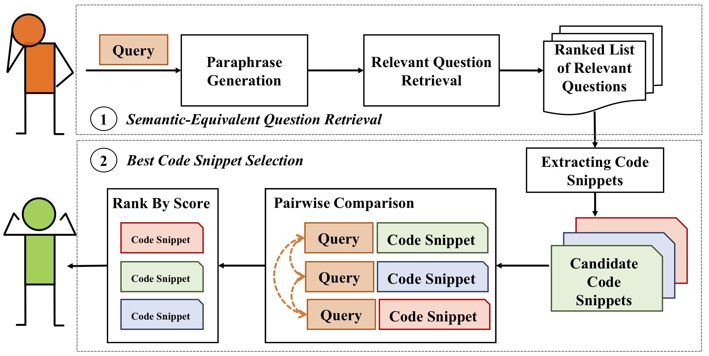
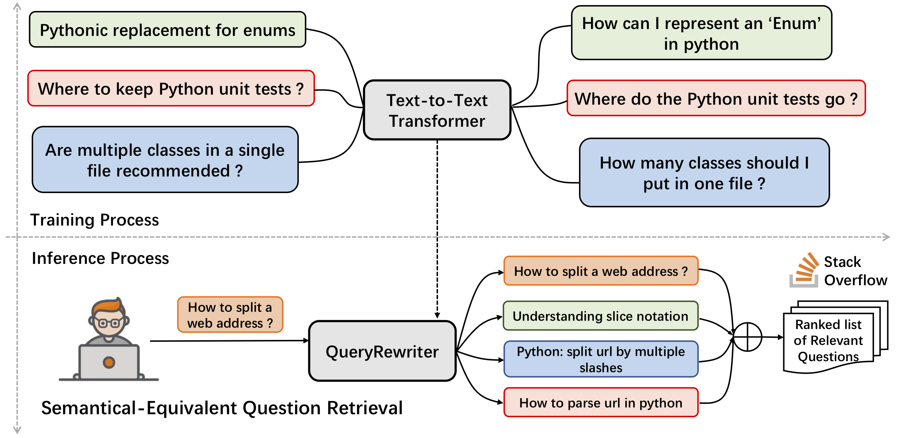
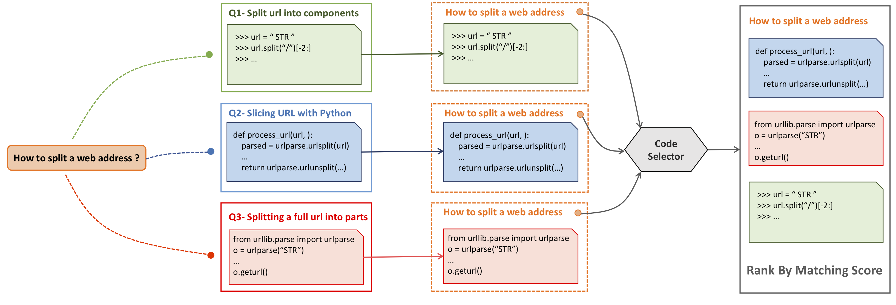

# I Know What You Are Searching For: Code Snippet Recommendation from Stack Overflow Posts




Stack Overflow has been heavily used by software developers to seek programming-related information.
Typically, when developers encounter a technical problem, they formulate the problem as a query and use a search engine to obtain a list of possible relevant posts that may containuseful solutions to their problem. 
However, this kind of solution-seeking experience can be difficult and painful because the **_Query Mistmatch_** and **_Information Overload_** problems. To alleviate these challenges, in this work we present a query-driven code recommendation tool, named _Que2Code_, that identifies the best code snippets for a user query from Stack Overflow posts. 
The material used in our can be accessed with: 

- [Source Code Link](https://github.com/beyondacm/Que2Code)
- [Dataset Download Link](https://drive.google.com/drive/folders/1-qlk1clhgy1Lzx4BIE5bW5fmEQsFSMjv?usp=sharing)
- [Pretrained Model Download Link](https://drive.google.com/drive/folders/1-E8pPL3ze7jHkR4_J6htAPk7iN94yInt?usp=sharing)
- [User Study](https://drive.google.com/file/d/1TJdpLwBFfdUcfvK42jLMGKNB4Ny87C_L/view?usp=sharing)


Our model contains two stages: 

1. _Semantically-Equivalent Question Retrieval_
2. _Best Code Snippet Recommendation_


Our model has two sub-components, i.e., **QueryRewriter** and **CodeSelector**. **QueryRewriter** can qualitatively retrieve semantically-equivalent questions, and the **CodeSelector** can quantitatively rank the most relevant code snippets to the top of the recommendation candidates.

## QueryRewriter

In the first stage, our **QueryRewriter** component tackles the _query mistmatch_ problem. 
The idea of **QueryRewriter** is to use a rewritten version of a query question to cover a variety of different forms of semantically equivalent expressions. 
In particular, we first collect the duplicate question pairs from Stack Overflow, because duplicate questions can be considered as semantically-equivalent questions of various user descriptions.
We then frame this problem as a sequence-to-sequence learning problem, which directly maps a technical question to its corresponding duplicate question. 
We train a text-to-text transformer, named **QueryRewriter**, by using the collected duplicate question pairs.


To train the **QueryRewriter**, please download our duplicate question dataset from the following link: [Dataset Download Link](https://drive.google.com/drive/folders/1-qlk1clhgy1Lzx4BIE5bW5fmEQsFSMjv?usp=sharing)

```shell
cd QueryRewriter/train/
python prepare_data.py
python train.py
```  

Or, we have released the pre-trained **QueryRewriter** model as described in the paper. You can use the following link to download our pretrained model: [Pretrained Model Download Link](https://drive.google.com/drive/folders/1-E8pPL3ze7jHkR4_J6htAPk7iN94yInt?usp=sharing)

The **QueryRewriter** can be easily used with the following way:

```
query = "how to iterate the list in python"
# Initialize the model 
QR_model = QueryRewriter()
# Get the embedding of a query
query_vec = QR_model.encode(query)
# Get the paraphrase questions of a query
paraphrase_q = QR_model.paraphrase(query)
```   

## CodeSelector

In the second stage, our **CodeSelector** component tackles the _information overload_ challenge. 
To do this, we first collect all the answers of the semantic relevant questions retrieved in the first stage. 
We then extract all the code snippets from the collected answer posts to construct a candidate code snippets pool.
For the given query question, we pair it with each of the code snippet candidates. We then fit them into the trained **CodeSelector** to estimate their matching scores and judge the preference orders.
**CodeSelector** can then select the best code snippet from the code snippet candidates via pairwise comparison. 
Our approach is fully data-driven and does not rely on hand-crafted rules.

To train the **CodeSelector**, please download our label query-code dataset from the following link: [Dataset Download Link](https://drive.google.com/drive/folders/1-qlk1clhgy1Lzx4BIE5bW5fmEQsFSMjv?usp=sharing). 
Then train the model with the following scripts: 

```shell
cd CodeSelector/train/
python data_prepare.py
python train.py
```  


Or, we have aslo released the pre-trained **CodeSelector** model as described in the paper. You can use the following link to download our pretrained model: [Pretrained Model Download Link](https://drive.google.com/drive/folders/1-E8pPL3ze7jHkR4_J6htAPk7iN94yInt?usp=sharing)

Our **CodeSelector** can also be used easily as following:

```shell
# Initilize the CodeSelector Model
cs_model = CodeSelector()
# Estimate the matching score between a query and a code snippet
score = cs_model.get_score(query, code_snippet)
```  


